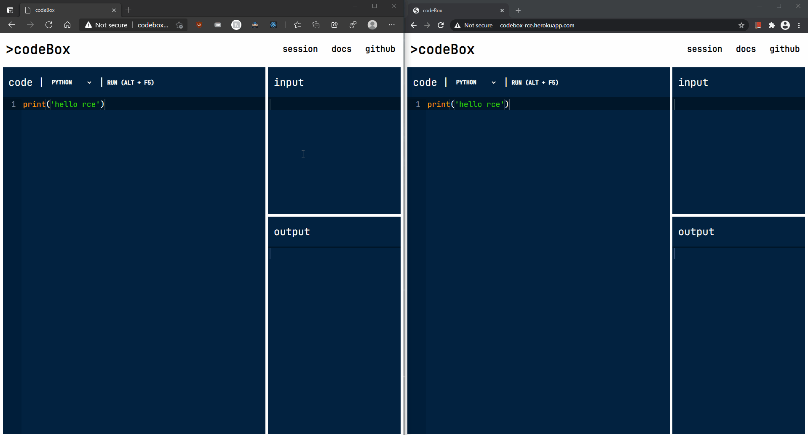

# *codeBox* - A Remote Code Executer

**Available at: http://codebox-rce.herokuapp.com**

> NOTE: Do **NOT** access the `https` version of the above site. The API server does not currently have an SSL certificate, and so the `https` client will not be able to communicate with the API due to the Mixed Content policy implemented in browsers.

> The API is seperately accessible [here](http://13.126.57.93/code), for use with Postman or cURL. However it is recommended to use the heroku app linked before.



***

## What Is It?

**codeBox RCE** is a service that provides a remote environment to run your code in. Execution occurs in a containerized space. The API supports programming in 3 languages (Python, Javascript and C++), potentially extendable to support more.

This RCE project provides a basic API to execute programs on a remote server. Basic code validation is performed to prevent possibly malicious code.

The client application, linked above, is available to access the API. It enables live sharing of your work through realtime communication with the server, aimed towards interview sessions. Each user obtains a `sessionId` key. Users can join another session by entering the other session's ID. Joining a session permits you to observe the session in read-only mode, only the session creator can edit the code and input.

## Features

- Sandboxed code execution on a remote server. Users can program in 3 languages without any local set up.
- Client app that incorporates all the features - Provides an easy and practical way to use the service. Locally caches user input for ease of use.
- Code validation - Dangerous libraries that can allow malicious execution are invalidated through /regex/ checks, and code containing such libraries are not executed.
- Live sessions. Each user can access and share their session's ID through the **`session`** menu in the navbar - Users can paste a session ID to join someone else's room from the same. (Only available through the client app)

## Set Up

User set up for this project is not required, as a deployed version can be accessed through the [client app](http://codebox-rce.herokuapp.com) (linked at the top).

However if you wish to set the project up yourself, documentation has been provided in the `docs` folder. Check out [DOCS.md](https://github.com/nafees87n/remote-code-executor/blob/main/docs/DOCS.md) for a detailed reference. It describes local machine setup and service functioning. Read [SERVER.md](https://github.com/nafees87n/remote-code-executor/blob/main/docs/SERVER.md) for documentation on deployment.

## Tech Stack

This RCE project combines various different technologies:

- Node and Express - Server and Executer services are written using these

- React - Client application is written with React

- Docker/docker-compose - Containerising of the services and providing an isolated sandbox for code execution

- Bash scripting - Convinience scripts for environment setup and project execution

## Functioning

The API accepts POST requests at the `localhost:9000/code` or `http://13.126.57.93/code` endpoint.

### Request JSON Keys:

- `key <String>` - A random string to uniquely identify each request. This string should function as a valid Linux file name, for reasons mentioned in the documentation. When using the client app, the key also serves as the session ID.

- `language <String>` - Represents the programming language to be used. Its value is identical to the file extension used by the language, as shown in the next section.

- `code <String>` - User provided code/program. Content is written to the source file to be executed.

- `input <String>` - User provided input for their code. It functions as the STDIN value for the executor

### Supported Languages:

- Python3 (use: _py_)

- C++ (use: _cpp_)

- Node/Javascript (use: _js_)

### Code Validation:

Currently, code validation takes place by selectively rejecting or accepting libraries depending on the language. The list of libraries of concern are listed below

#### Python (Rejected Libraries):
```
os | subprocess | shlex | xml | pickle
```
#### C++ (Accepted Libraries):
```
iostream | algorithm | stdio    | cstdio | vector | math | cmath | cstring | string |
deque    | iomanip   | iterator | map    | queue  | set  | stack | conio   | ctype
```
#### Node/Javascript (Accepted Libraries):
```
readline | buffer | string_decoder | timers | stream | util
```
